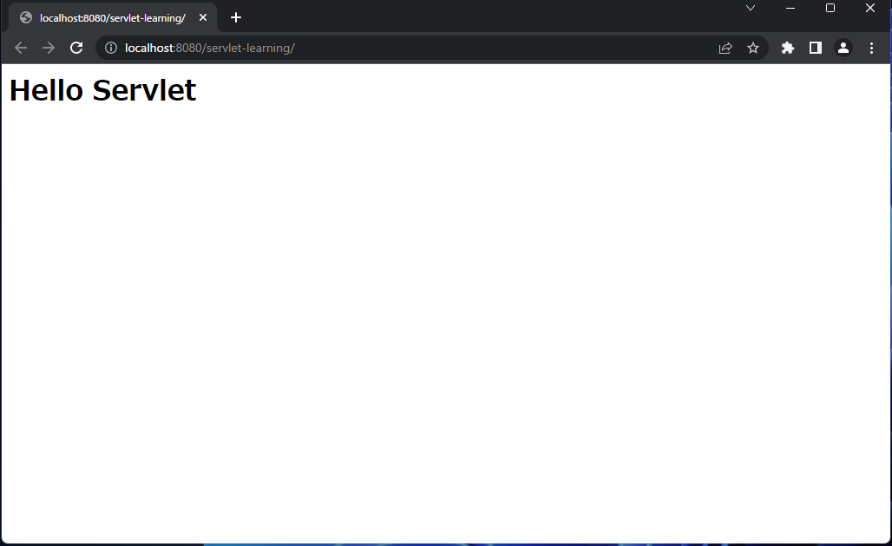

# 1. サーブレット入門

サーブレットとは Web サーバ上で動作する JAVA プログラムで、Web ページを動的に生成したりデータ処理を行ったりします。
これから実際に Eclipse を使って、サーブレットを利用した簡単な Web アプリケーションを作ってみましょう。

## 動的Webプロジェクトの作成

Eclipse を使ってサーブレットプログラムを作る場合、まず動的 Web プロジェクトを作成します。
ファイル > 新規 > 動的 Web プロジェクト を選択[^1]すると「新規動的Webプロジェクト」ウィンドウが出てくるので、そこにプロジェクト名を入力します。

[^1]: 新規から動的 Web プロジェクトが見つからない場合、その他を選ぶとウィザードが開くので、そこから Web > 動的 Web プロジェクト を選択する。


ここではプロジェクト名に「servlet-learning」[^2]と入力してプロジェクトを作成しましょう。
ターゲット・ランタイムはデフォルトのままで構いませんが、最低でもTomcat8(Java8) 以上にしてください。(動的 Web モジュールバージョンや構成はターゲット・ランタイムに合わせて自動的に変更されます)
完了ボタンを押すとプロジェクトが作成されます。

[^2]: このプロジェクト名がデフォルトのコンテキストパスとなり、<http://localhost:8080/プロジェクト名/URLパターン>として実行できるようになる。

## Webページを表示する

サーブレットによる Web アプリケーションは実行すると

> <http://ホスト名(:ポート番号)/コンテキストパス/URLパターン>

というURLで表示することができます。Eclipse で実行する場合、「ホスト名(:ポート番号)」が「localhost:8080」、「コンテキストパス」が「プロジェクト名」となります。

それでは最初に <http://localhost:8080/servlet-learning/> で表示するページを作成してみましょう。

### サーブレットクラスの作成

まずは、URLパターン「/」へのリクエストを処理するサーブレットクラスを作成します。

1. Eclipse のパッケージエクスプローラーから先ほど作った servlet-learning プロジェクトを開き、「src/main/java」の上で右クリックをしてから 新規 > その他 を選択、ウィザードから Web > サーブレットを選択し「次へ」をクリックします。[^3]
1. 「サーブレット作成」が開くので、「Java パッケージ:」に「servlet」、「クラス名:」に「IndexServlet」と入力して「次へ」をクリックします。

   

1. 「URLマッピング」がデフォルトで「/サーブレット名」("/IndexServlet") となっているので、編集ボタンを押し、「パターン」を "/" に修正してください。

   

1. 修正して「次へ」行くと、「どのメソッド・スタブを作成しますか？」であらかじめ用意しておくメソッドを選択することができるので、ここでは doPost のチェックを外して doGet だけにし、「完了」を押します。

   

すると src/main/java の中に servlet パッケージが、さらにその中に IndexServlet.java が作成されます。

[^3]: Eclipse のバージョンによっては「src」になっている場合があるので、そのときは src/main/java を src と読み替える

### サーブレットの実行

続いて、早速このサーブレットを実行してみましょう。
先ほど作成した IndexServlet.java の上で右クリック > 実行 > サーバで実行 を選択します。
すると使用するサーバを聞かれるので「既存のサーバを選択」を選び、表示されているサーバからプロジェクト作成時にターゲット・ランタイムで指定したものを選択、それから「このプロジェクトを実行するときは常にこのサーバを使用」にチェックを入れ「完了」を押します。


すると Web ブラウザーが起動し、以下のようなページが表示されます。


もしこのページがブラウザーではなく Eclipse 上に表示された場合は、ウィンドウ > 設定 > 一般 > Web ブラウザー で「外部 Web ブラウザーを使用」にチェックを入れて実行しなおすと Web ブラウザーで表示されるようになります。

### サーブレットクラスの構成

ここで IndexServlet クラスの中身を見てみましょう。

```java
package servlet;

import java.io.IOException;
import javax.servlet.ServletException;
import javax.servlet.annotation.WebServlet;
import javax.servlet.http.HttpServlet;
import javax.servlet.http.HttpServletRequest;
import javax.servlet.http.HttpServletResponse;

/**
 * Servlet implementation class IndexServlet
 */
@WebServlet("/")
public class IndexServlet extends HttpServlet {
    private static final long serialVersionUID = 1L;
       
    /**
     * @see HttpServlet#HttpServlet()
     */
    public IndexServlet() {
        super();
        // TODO Auto-generated constructor stub
    }

    /**
     * @see HttpServlet#doGet(HttpServletRequest request, HttpServletResponse response)
     */
    protected void doGet(HttpServletRequest request, HttpServletResponse response) throws ServletException, IOException {
        // TODO Auto-generated method stub
        response.getWriter().append("Served at: ").append(request.getContextPath());
    }

}
```

@WebServlet アノテーションでこのサーブレットクラスが担当する URL パターン（この場合は"/"）を指定しています。

試しにこの URL パターンを "/hello" に書き換えて実行しなおしてみてください。（「サーバを再起動しますか？」と聞かれたら「サーバ再起動」を選択してください）

先ほどと同じ内容のページが表示されますが、そのURLは

> <http://localhost:8080/servlet-learning/>

から

> <http://localhost:8080/servlet-learning/hello>

に変わっているのが分かります。（試した後はURLパターンを"/"に戻しておいてください）

doGet() メソッドでこの URL パターンに対する HTTP の GET リクエストを処理します。引数の HttpServletRequest オブジェクトはクライアントから受け取ったリクエストを、HttpServletResponse オブジェクトはクライアントへ返すレスポンスを表しています。つまりこのレスポンスに HTML を書き込んでやれば、それがクライアントに返され、ブラウザに表示されることになります。

それでは実際に HTML を書き込んでみましょう。HttpServletResponse オブジェクトから getWriter() メソッドで PrintWriter オブジェクトを取り出し、println() メソッドを使って HTML 文字列を書き込みます。ちょうどコンソールに文字を出力するのに System.out.println() を使うのと同じイメージです。

doGet() の中身を下記のように書き換えてください。

```java
    protected void doGet(HttpServletRequest request, HttpServletResponse response) throws ServletException, IOException {
        PrintWriter out = response.getWriter();
        out.println("<!DOCTYPE html>");
        out.println("<html lang=\"ja\">");
        out.println("<head></head>");
        out.println("<body>");
        out.println("  <h1>Hello Servlet</h1>");
        out.println("</body>");
    }
```

このサーブレットを実行すると下記のように表示されます。ブラウザで「ページのソースを表示」とすると上で書きこまれたものと同じ HTML が確認できます。



### 日本語の出力

今度は日本語を表示させてみましょう。「Hello Servlet」の下に\<p>タグで「これが初めてのサーブレットです」と表示されるように修正して実行してみてください。

すると「Hello Servlet」はそのまま表示されているのに、日本語は文字化けしてしまっています。


日本語を表示するためには、レスポンスのコンテンツタイプで文字コードを指定してやる必要があります。doGet() メソッドの先頭に下記の行を追加して実行してみてください。

```java
        response.setContentType("text/html; charset=UTF-8");
```

今度は文字化けせずに日本語が表示されているはずです。


---
[2. JSP](2.JSP.md) へ進む
